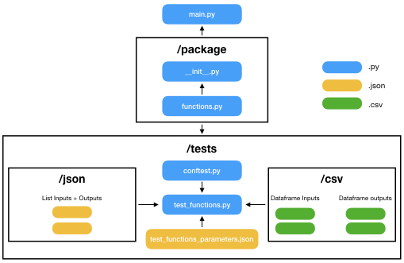

# template-pytest_driven_development_folder

This project is designed to simplify testing with python and pytest. We provide a simple folder structure template for writing code and testing it. We give a few examples showing how to industrialize and simplify testing functions taking common python objects as inputs and outputs, such as integer, strings, lists, as well as pandas dataframes and series.

<p align="center">
  
</p>

The folder provides the following elements that can be customized depending on your needs :
- **main.py** : main file at the root of the directory
- **./package** : directory where your functions are located
  - functions.py : file with example functions to use in the main or to be tested
- **./tests** : directory where tests are processed
  - conftest.py : common test file where useful functions are defined and imports are made
  - test_functions.py : file to test the functions available in the functions.py file
  - test_functions.json : file to store scenarios to test. The JSON file is then imported in test_functions.py the @pytest.mark.parametrize decorator is ultimately used to pass the scenarios the each test function.
- **./tests/json** : directory containing files providing inputs and outputs for testing functions with lists as inputs. When used, these files are mentionned in test_functions.json.
- **./tests/csv** : directory containing files providing inputs and outputs for testing functions with pandas dataframe or series as inputs. When used, these files are mentionned in test_functions.json.

## Requirements & Setup

Make sure you have Pytest installed. Other regular packages are used such as json, numpy, pandas, ...

```console
pip3 install pytest
```

## How to use the folder

All commands can be run from the root of the directory.

To run the main :

```console
python3 main.py
```

To run the tests :

```console
pytest -v
```
